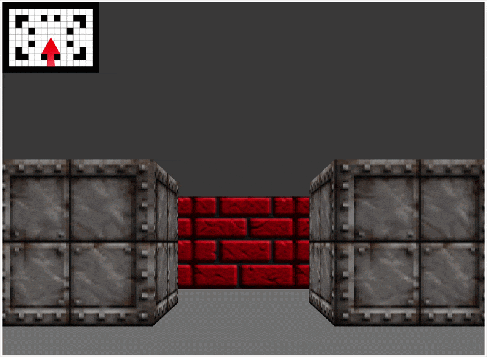

# Typenstein3D

> A browser-based typing game inspired by Wolfenstein 3D

Typenstein3D is planned to become a browser-based raycast 3D first-person typing game built with TypeScript, inspired by the techniques used in **Wolfenstein 3D** (1992) by Id Software.



## Table of Contents

- [Getting Started](#getting-started)
- [Project Structure](#project-structure)
- [Tech Stack](#tech-stack)
- [Theming](#theming)
- [Debugging Options](#debug-options)
- [How Raycasting Works](#how-raycasting-works)
- [The DDA Algorithm](#the-dda-algorithm)
- [Contributing](#contributing)

## Getting Started

```bash
npm install
npm run ts:compile
npm start           # Served by default at http://localhost:3000 
```

### Development Commands

```bash
npm run ts:watch           # Recompile on save
npm start                  # Serve at http://localhost:3000 (Python web server)
npm test                   # Run all unit tests
npm run test:coverage      # Generate coverage report
npm run ts:format:write    # Run prettier in write mode
npm run ts:lint            # Run ESLint in src/ and test/
npm run build:docs         # Build documentation -> docs/
```

### Controls

| Key | Action          |
| --- | --------------- |
| ↑, w  | Move forward  |
| ↓, s  | Move backward |
| ←, a  | Turn left     |
| →, d  | Turn right    |

## Theming

The color theme is configurable via the `theme` object, which is exposed on `window.theme` in the browser. Modify any property to see changes in real time. These might be out of date, so check `theme.ts` for the latest. 

| Property            | Default     | Description                        |
| ------------------- | ----------- | ---------------------------------- |
| `map.tileBorder`    | `"#000"`    | Color of the grid lines on the map |
| `map.floor`         | `"#fff"`    | Color of floor tiles on the map    |
| `map.wall`          | `"#000"`    | Color of wall tiles on the map     |
| `map.player`        | `"#ff0000"` | Color of the player dot on the map |
| `map.rays`          | `"#ff0000"` | Color of the cast rays on the map  |
| `map.rotationAngle` | `"#0000ff"` | Color of the rotation angle line   |
| `gradientShading`   | `false`     | Enable distance-based wall shading |
| `gradientScale`     | `0.001`     | Intensity of the gradient shading  |
| `sky`               | `"#333333"` | Color of the sky (upper half)      |
| `floor`             | `"#2b2b2b"` | Color of the floor (lower half)    |

## Debug Options

Runtime debug flags are exposed on `window.debugOptions` in the browser. Toggle them in the console without reloading. 
These might be out of date, so check `theme.ts` for the latest. 

| Property         | Default | Description                                      |
| ---------------- | ------- | ------------------------------------------------ |
| `map`            | `true`  | Show the top-down map overlay                    |
| `singleRay`      | `false` | Cast and render only a single ray                |
| `rotationAngle`  | `false` | Draw the player's forward angle line on the map  |
| `wallProjection` | `true`  | Render the 3D wall projection                    |
| `mapScale`       | `0.2`   | Scale factor applied to the top-down map overlay |

## How Raycasting Works

Raycasting is the illusion of 3D by working entirely in 2D. From a top-down perspective, the player stands in a tile-based grid and looks out across a field of view (FOV). For each vertical column of the screen, a single ray is fired into the map at a slightly different angle across that FOV.

When a ray hits a wall, its distance back to the player determines how tall that wall column is drawn on screen. Close walls appear tall; distant walls appear short. Repeat this for every screen column and you get the depth illusion.

## The DDA Algorithm

This engine uses the **Digital Differential Analysis (DDA)** algorithm to find where each ray intersects the map grid. This is used instead of vectors to be more inline with the original implementation Id Software used in Wolfenstein 3D.


```
  ┌──────┬──────┬──────┐
  │▓▓▓▓▓▓│▓▓▓▓▓▓│▓▓▓▓▓▓│  ← Wall
  ├──────┼───h──┼──────┤  h = horizontal grid crossing
  │      │  ╱   │▓▓▓▓▓▓│  v = vertical grid crossing
  ├──────|─╱────┼──────┤
  │      v      │▓▓▓▓▓▓│
  ├─────╱┼──────┼──────┤
  │    / │      │▓▓▓▓▓▓│
  ├───╱──┼──────┼──────┤
     P
```

DDA walks each set of crossings independently, stepping h forward, then v forward, and at each step checks whether the tile at that crossing is a wall. Whichever crossing (horizontal or vertical) reaches a wall first is the actual collision point. That distance is then used to compute the height of that column from the projection plane.
